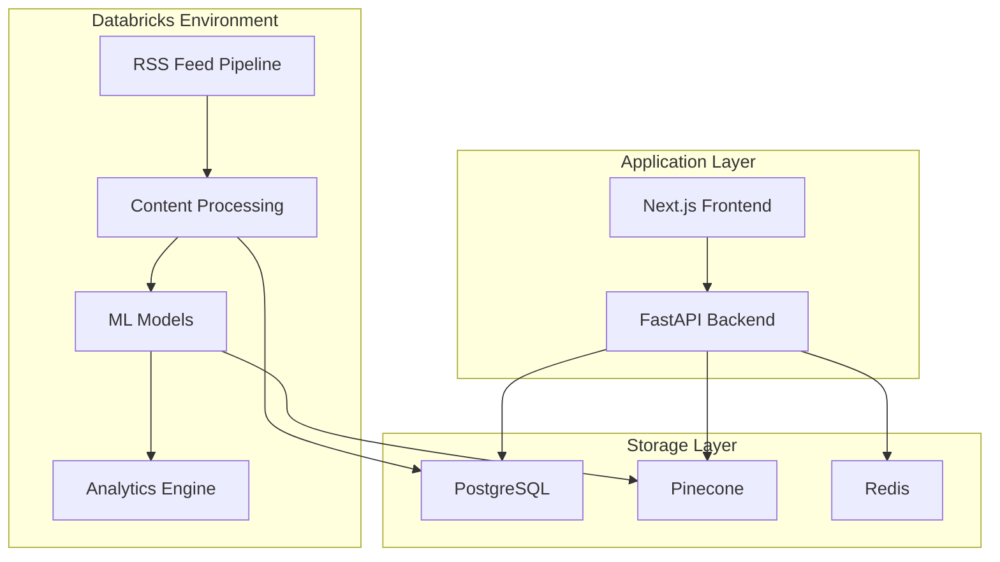
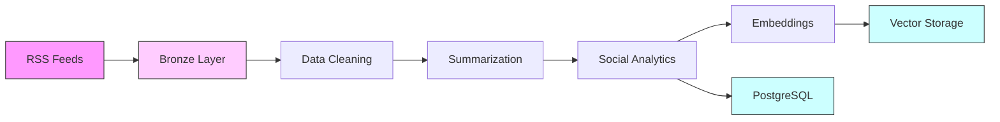
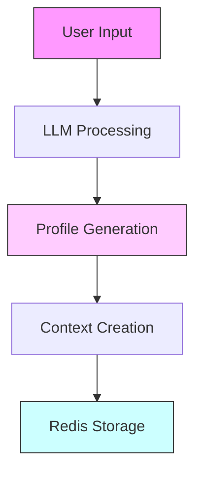
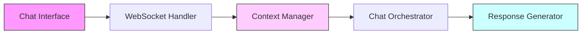

# WhatsGood - AI-Powered Content Intelligence Platform

## Table of Contents
- [Overview](#overview)
- [System Architecture](#system-architecture)
- [Data Pipeline](#data-pipeline)
- [Platform Components](#platform-components)
- [Technical Implementation](#technical-implementation)
- [Setup and Installation](#setup-and-installation)
- [API Documentation](#api-documentation)
- [Development Guidelines](#development-guidelines)
- [Monitoring and Maintenance](#monitoring-and-maintenance)

## Overview

### Purpose
WhatsGood is an advanced content intelligence platform that bridges the gap between content creators and relevant industry insights. By combining AI-powered content analysis, personalized recommendations, and automated content generation, it enables brands to stay ahead in their content strategy.

### Key Features
- 🔄 Automated content aggregation and analysis
- 🧠 AI-powered content summarization and insights
- 💡 Brand-aligned content recommendations
- 🤖 Context-aware content generation assistant
- 📊 Real-time social media analytics
- 🎯 Personalized brand profiling

## System Architecture

### High-Level Architecture


### Technology Stack
1. **Data Processing**
   - Databricks
   - Delta Lake
   - MLflow
   - Apache Spark

2. **Machine Learning**
   - OpenAI GPT-3.5-turbo-instruct
   - Mistral
   - all-MiniLM-L6-v2
   - Sentence Transformers

3. **Storage**
   - PostgreSQL
   - Pinecone Vector DB
   - Redis Memory Store

4. **Backend**
   - FastAPI
   - WebSockets
   - SQLAlchemy
   - Alembic

5. **Frontend**
   - Next.js
   - TypeScript
   - Tailwind CSS
   - React Components

## Data Pipeline

### Pipeline Overview


### Detailed Pipeline Steps

#### 1. Content Ingestion (Bronze Layer)
**Implementation**: `1_rss_scraper_bronze`
```python
# Databricks job configuration
job_config = {
    "schedule_interval": "2 days",
    "retry_policy": {
        "max_retries": 3,
        "min_retry_interval_millis": 2 * 60 * 1000,
        "max_retry_interval_millis": 10 * 60 * 1000
    }
}
```

#### 2. Data Cleaning
**Implementation**: `2_data_cleaning`
- Content standardization
- Metadata extraction
- Quality validation
- Delta Lake silver table storage

#### 3. Content Analysis
**Implementation**: `3_summarize_articles`
```python
# MLflow tracking
with mlflow.start_run():
    mlflow.log_params({
        "model": "mistral",
        "max_length": 1024,
        "topics_count": 5
    })
```

#### 4. Social Enrichment
**Implementation**: `4_social_media_enrichment`
- Reddit API integration
- Sentiment analysis
- Engagement metrics
- Trend identification

#### 5. Storage Layer
**Implementation**: `5_store_in_postgresql`
```sql
-- Article schema
CREATE TABLE articles (
    article_id UUID PRIMARY KEY,
    title TEXT NOT NULL,
    content TEXT NOT NULL,
    summary TEXT,
    topics JSONB,
    social_metrics JSONB,
    created_at TIMESTAMP WITH TIME ZONE DEFAULT CURRENT_TIMESTAMP
);
```

#### 6. Embedding Generation
**Implementation**: `6_generate_embeddings`
```python
# Embedding configuration
embedding_config = {
    "model": "sentence-transformers/all-MiniLM-L6-v2",
    "dimension": 384,
    "normalize": True
}
```

#### 7. Vector Storage
**Implementation**: `7_push_embeddings_to_pinecone`
- Batch processing
- Index management
- Metadata handling
- Cleanup routines

## Platform Components

### Brand Processing System


### Content Retrieval System
```python
class RetrievalSystem:
    def __init__(self):
        self.hyde_strategy = HyDEStrategy()
        self.self_query = SelfQueryStrategy()
        
    async def get_relevant_articles(self, brand_context):
        hyde_results = await self.hyde_strategy.retrieve()
        query_results = await self.self_query.retrieve()
        return self.merge_results(hyde_results, query_results)
```

### Chat System Architecture


## Technical Implementation

### FastAPI Backend
```python
# Main application setup
app = FastAPI(
    title="WhatsGood API",
    description="Content Intelligence Platform API",
    version="1.0.0"
)

# CORS configuration
app.add_middleware(
    CORSMiddleware,
    allow_origins=settings.ALLOWED_ORIGINS,
    allow_credentials=True,
    allow_methods=["*"],
    allow_headers=["*"]
)
```

### Next.js Frontend
```typescript
// Chat interface implementation
const ChatInterface: React.FC<ChatProps> = ({ articleId, brandId }) => {
    const [messages, setMessages] = useState<Message[]>([]);
    const websocket = useWebSocket(`${WS_URL}/ws/${clientId}`);
    
    const sendMessage = async (content: string) => {
        await websocket.send(JSON.stringify({
            content,
            article_id: articleId,
            brand_id: brandId
        }));
    };
}
```

### Redis Memory Store
```python
class RedisMemoryStore:
    """Hierarchical context management"""
    def __init__(self, redis_client):
        self.redis = redis_client
        self.prefix = "chat:memory:"
        
    async def store_context(self, article_id: str, brand_id: int, context: dict):
        key = f"{self.prefix}{article_id}:{brand_id}"
        await self.redis.setex(key, 3600, json.dumps(context))
```

## Setup and Installation

### Prerequisites
```bash
# System requirements
python >= 3.8
node >= 14
postgresql
redis
```

### Backend Setup
```bash
# Environment setup
python -m venv venv
source venv/bin/activate

# Install dependencies
pip install -r requirements.txt

# Database migrations
alembic upgrade head
```

### Frontend Setup
```bash
# Install dependencies
cd frontend
npm install

# Development server
npm run dev
```

## API Documentation

### Authentication Endpoints
```typescript
interface AuthEndpoints {
    signup: '/auth/signup',
    login: '/auth/login',
    profile: '/auth/me'
}
```

### Article Endpoints
```typescript
interface ArticleEndpoints {
    recommended: '/api/articles/recommended/:brandId',
    details: '/api/articles/:articleId',
    chat: '/api/articles/:articleId/init-chat'
}
```

### WebSocket Protocol
```typescript
interface WebSocketMessage {
    type: 'message' | 'status' | 'error';
    content: string;
    metadata?: {
        platform?: string;
        confidence?: number;
    };
}
```

## Development Guidelines

### Project Structure
```plaintext
.
├── backend/
│   ├── app/
│   │   ├── api/
│   │   ├── core/
│   │   ├── models/
│   │   └── services/
│   └── databricks/
│       ├── notebooks/
│       └── jobs/
├── frontend/
│   ├── src/
│   │   ├── components/
│   │   ├── pages/
│   │   └── services/
└── docs/
```

### Coding Standards
- Type safety with TypeScript
- Async/await patterns
- Error handling
- Documentation
- Testing requirements

## Monitoring and Maintenance

### Databricks Monitoring
- Pipeline health checks
- Job success rates
- Resource utilization
- Model performance

### Application Monitoring
- API response times
- Error rates
- User engagement
- System resources

### Data Quality
- Content freshness
- Embedding quality
- Recommendation relevance
- Chat response quality

## Future Roadmap
1. Enhanced social media integration
2. Real-time processing pipeline
3. Advanced analytics dashboard
4. Multi-language support
5. Custom model training

## License
This project is licensed under the MIT License - see the [LICENSE](LICENSE) file for details.
